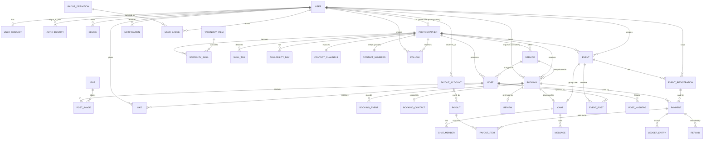

# Mô hình miền

Thực thể, đối tượng giá trị, quan hệ và danh mục enum của hệ thống, **độc lập với nơi lưu trữ**. Quy chuẩn kiểu ở [README.md](README.md) mục 2; bảng lưu trữ ở [relational-schema.md](relational-schema.md). Mã lớp bằng Dart (bất biến, freezed) ở `lib/domain/`; máy chủ dùng cùng tên khái niệm.

## 1. Đối tượng giá trị (value objects)

Bất biến, so sánh theo giá trị, tự kiểm tra hợp lệ khi tạo. Không có danh tính riêng.

| Đối tượng | Trường | Quy tắc |
|-----------|--------|---------|
| `Id<T>` | `value: String` | 1–64 ký tự `[A-Za-z0-9_-]`; không so sánh giữa kiểu `T` khác nhau |
| `Instant` | `utc: DateTime` | Luôn UTC; JSON ISO‑8601 `Z` |
| `LocalDate` | `y, m, d` | Ngày theo múi giờ Asia/Ho_Chi_Minh; JSON `yyyy-MM-dd` |
| `LocalTime` | `h, m` | `HH:mm`, bội số 5 phút trong giao diện, lưu phút |
| `Money` | `amount: int`, `currency: String = 'VND'` | `amount ≥ 0`; phép cộng cùng tiền tệ; `percent(30)` làm tròn xuống |
| `GeoPoint` | `lat: double`, `lng: double` | `-90..90`, `-180..180`; sinh `geohash(precision)` |
| `PhoneNumber` | `e164: String` | Chuẩn hoá `+84…`; kiểm `^(?:\+84\|0)(3\|5\|7\|8\|9)\d{8}$` cho số VN; quốc tế `^\+\d{8,15}$`; `masked()` trả `0903 ••• 456` |
| `FileRef` | `fileId: Id<File>` | Tham chiếu tới `File`; URL dựng lúc chạy |
| `Rating` | `value: int` | 1..5 |
| `TicketCode` | `value: String` | `VE-XXXX-MMDD`, duy nhất; chữ in hoa không có `0/O/1/I` |
| `Percent` | `value: int` | 0..100 |
| `DateRange`, `TimeRange` | `start, end` | `start < end` |
| `Reason` | `code: ReasonCode`, `text: String` | Lý do gợi ý |

## 2. Thực thể

Ký hiệu: **PK** khoá chính, **FK** khoá ngoại, `?` có thể rỗng, `🔒` dữ liệu nhạy cảm (tách bảng riêng).

### 2.1 Tài khoản và hồ sơ

| Thực thể | Trường chính | Ghi chú |
|----------|--------------|---------|
| `User` | `id` PK, `displayName`, `avatar: FileRef?`, `role: UserRole?`, `staffRole: StaffRole?`, `city?`, `locale = 'vi'`, `createdAt`, `updatedAt`, `deletedAt?` | `role = null` cho tới khi chọn ở màn chọn vai trò; `staffRole` chỉ do admin đặt |
| `UserContact` 🔒 | `userId` PK/FK, `phone: PhoneNumber`, `phoneVerified = false`, `allowZalo = true`, `allowWhatsApp = false`, `updatedAt` | Số điện thoại khách; không nằm trong `User` (công khai) |
| `AuthIdentity` 🔒 | `id` PK, `userId` FK, `provider: AuthProvider`, `subject`, `email?`, `createdAt` | `(provider, subject)` duy nhất; cho phép đổi IdP |
| `Device` 🔒 | `id` PK, `userId` FK, `provider: PushProvider`, `token`, `platform`, `lastSeenAt` | Thay `users.fcmTokens` |
| `File` | `id` PK, `ownerUserId` FK, `storageProvider`, `storageKey`, `mimeType`, `sizeBytes`, `width?`, `height?`, `blurhash?`, `createdAt` | Mọi ảnh/tệp |

### 2.2 Nhiếp ảnh gia

| Thực thể | Trường chính | Ghi chú |
|----------|--------------|---------|
| `Photographer` | `userId` PK/FK, `bio`, `yearsExperience`, `serviceArea: {city, center: GeoPoint, radiusKm}`, `cover: FileRef?`, `verified = false`, `verifiedAt?`, `onboardingComplete = false`, `acceptsInquiries = true`, `stats: PhotographerStats` | `stats` do dịch vụ tính |
| `PhotographerStats` | `ratingAvg`, `reviewCount`, `completedCount`, `responseMinutesMedian?`, `startingPrice: Money?`, `nextFreeDate?`, `skillsCompleteness`, `skillsCompletenessNext?` (mã bước còn thiếu đầu tiên), `skillsCompletenessNextAfter?` (điểm sau bước đó), `skillsEvidenceRemovedAt?` (lần Function gỡ minh chứng gần nhất) | Giá trị dẫn xuất, ghi bởi use case. Bất biến: `stats.rating` luôn được ghi (0 khi chưa có đánh giá) mỗi khi `stats.nextFreeDate` được ghi; thợ ảnh thiếu `stats.rating` sẽ không xuất hiện trong `freeThisWeek` |
| `ContactChannels` | `photographerId` PK/FK, `call`, `zalo`, `whatsapp` | Công khai (cờ) |
| `ContactNumbers` 🔒 | `photographerId` PK/FK, `phone`, `zaloPhone?`, `whatsappPhone?` | Không lộ ra khỏi use case `get_contact_link` |
| `Service` (gói) | `id` PK, `photographerId` FK, `name`, `specialtyId?`, `durationMinutes`, `price: Money` (> 0), `photoCount`, `editedCount`, `deliveryDays`, `cover?`, `active` | |
| `SpecialtySkill` | `photographerId`, `specialtyId`, `level: SkillLevel (1..3)`, `years?`, `evidence: List<Id<Post>>` | Tối đa 6 thể loại, 3 mức 3 |
| `SkillTag` | `photographerId`, `group: SkillGroup`, `itemId` | style, extra, language, audience |
| `TaxonomyItem` | `id` PK (mã), `group`, `labelVi`, `parentId?`, `sortOrder`, `active` | Danh mục thể loại, phong cách, kỹ năng, ngôn ngữ, đối tượng, khu vực |
| `AvailabilityDay` | `photographerId`, `day: LocalDate`, `state: DayState`, `bookingId?`, `eventId?` | PK `(photographerId, day)`; không có bản ghi = rảnh |

### 2.3 Nội dung

| Thực thể | Trường chính | Ghi chú |
|----------|--------------|---------|
| `Post` | `id` PK, `authorId` FK, `kind: PostKind` (`work`, `real_shoot`, `event_share`), `photographerId` FK, `serviceId` FK, `bookingId?`, `caption`, `location: {name, point, geohash}`, `styleId?`, `specialty?` (= `specialtyId` của dịch vụ, phi chuẩn hoá), `hashtags` (chữ thường, không dấu `#`), `inPortfolio`, `likeCount`, `saveCount`, `createdAt`, `deletedAt?` | `serviceId` bắt buộc |
| `PostImage` | `postId`, `position`, `file: FileRef` | 1–10 ảnh; ánh xạ từ `imageMeta[]` (`blurHash`, `w`, `h`) → `post_images` |
| `PostHashtag` | `postId`, `tag` (chữ thường, không dấu `#`) | PK ghép; trích từ chú thích khi ghi bài |
| `Like`, `Save` | `userId`, `postId`, `createdAt` | PK ghép; đếm là dẫn xuất |
| `Follow` | `followerId`, `photographerId`, `createdAt` | PK ghép; marker Firestore `userId` ↔ `follower_id` |

### 2.4 Đặt lịch và thanh toán

| Thực thể | Trường chính | Ghi chú |
|----------|--------------|---------|
| `Booking` | `id` PK, `customerId`, `photographerId`, `serviceId`, `serviceSnapshot: {name, price: Money, durationMinutes}`, `day: LocalDate`, `start: LocalTime`, `end: LocalTime`, `place: {name, point?}`, `note?`, `status: BookingStatus`, `deposit: Money`, `remaining: Money`, `depositProvider?`, `depositPaidAt?`, `depositRefundedAt?`, `acceptDeadline?: Instant`, `cancel?: {by, reason, at, refundPercent}`, `chatId?`, `version`, `createdAt`, `updatedAt` | Snapshot gói tại thời điểm đặt |
| `BookingEvent` | `id` PK, `bookingId`, `status`, `at: Instant`, `actorId?` | Dòng thời gian (thay `timeline[]`) |
| `BookingContact` 🔒 | `bookingId` PK/FK, `name`, `phone`, `allowZalo`, `allowWhatsApp`, `redactedAt?` | Chụp lúc yêu cầu; xoá số sau 30 ngày |
| `Payment` | `id` PK, `subjectType: PaymentSubject`, `subjectId`, `payeeId?` (nhiếp ảnh gia hoặc chủ sự kiện nhận tiền), `provider: PaymentProvider`, `amount: Money`, `status: PaymentStatus`, `escrowStatus: EscrowStatus`, `releasedAt?`, `releaseAfter?`, `providerRef?`, `raw?: json`, `idempotencyKey`, `createdAt`, `updatedAt` | Dùng cho cọc và vé; `escrowStatus` theo dõi tiền treo |
| `LedgerEntry` | `id` PK, `type: LedgerEntryType`, `paymentId?`, `refundId?`, `payoutId?`, `subjectType?`, `subjectId?`, `accountOwnerId?`, `amount: Money` (có dấu), `note?`, `at: Instant` | **Bất biến, chỉ thêm**; số dư treo/chờ chi trả suy ra từ tổng |
| `PayoutAccount` 🔒 | `id` PK, `userId` FK, `bankCode`, `accountNumberEnc`, `accountLast4`, `holderName`, `active`, `createdAt` | Tài khoản nhận tiền; số được mã hoá |
| `Payout` | `id` PK, `payeeId` FK, `amount: Money`, `status: PayoutStatus`, `accountId` FK, `reference?`, `createdAt`, `scheduledAt?`, `paidAt?`, `failureReason?`, `approvedBy?` | Lô chi trả cho một người nhận |
| `PayoutItem` | `payoutId`, `paymentId`, `amount: Money` | Khoản nào nằm trong lô nào; PK ghép |
| `Refund` | `id` PK, `paymentId` FK, `amount: Money`, `percent`, `status`, `manual`, `createdAt` | |
| `Review` | `bookingId` PK/FK, `customerId`, `photographerId`, `rating: Rating`, `text`, `photoPostId?`, `createdAt` | Một đánh giá/booking |

### 2.5 Trò chuyện và thông báo

| Thực thể | Trường chính | Ghi chú |
|----------|--------------|---------|
| `Chat` | `id` PK, `kind: ChatKind` (`inquiry`, `booking`, `event_group`), `bookingId?` (duy nhất khi có), `eventId?` (duy nhất khi `event_group`), `customerId?`, `photographerId?` (rỗng với nhóm), `assigneeId?` (nhân viên hỗ trợ, chat hỏi trước của sự kiện nền tảng), `moderatorsOnly = false`, `photographerRepliedAt?`, `lastMessageAt?`, `lastMessagePreview?`, `closedAt?` | `inquiry` → thành `booking` khi gắn `bookingId`; `photographerRepliedAt != null` gỡ giới hạn 3 tin |
| `ChatMember` | `chatId`, `userId`, `role: ChatMemberRole`, `mutedUntil?`, `unreadCount`, `lastReadAt?`, `joinedAt`, `removedAt?` | Thành viên nhóm sự kiện có vai `member`/`moderator` |
| `ChatPin` | `chatId`, `messageId`, `pinnedBy`, `pinnedAt` | Tin ghim (thông báo của chủ sự kiện) |
| `Message` | `id` PK, `chatId`, `senderId?`, `type: MessageType`, `body?`, `file?`, `point?`, `createdAt`, `deletedAt?` | `system` không có người gửi |
| `Notification` | `id` PK, `userId`, `type`, `title`, `body`, `bookingId?`, `postId?`, `eventId?`, `readAt?`, `createdAt` | |

### 2.6 Sự kiện

| Thực thể | Trường chính | Ghi chú |
|----------|--------------|---------|
| `Event` | `id` PK, `hashtag` (duy nhất, chữ không dấu + số), `chatId?`, `host: {type: HostType, photographerId?}`, `createdBy`, `createdByRole`, `title`, `description`, `cover: FileRef`, `type: EventType`, `startsAt: Instant`, `endsAt: Instant`, `location: {name, meetingPoint?, point, geohash}`, `capacity`, `price: Money` (≥ 0; 0 = không thu phí), `registrationDeadline`, `status: EventStatus`, `registeredCount`, `heldCount`, `hostConsent: HostConsent`, `version`, `createdAt`, `updatedAt` | `isFree` = `price.amount == 0` |
| `EventPost` | `eventId`, `postId`, `source: EventPostSource`, `status: EventPostStatus`, `addedAt`, `moderatedBy?` | PK ghép; bài hiện trên timeline sự kiện |
| `EventRegistration` | `id` PK, `eventId`, `userId`, `name`, `phone` 🔒, `quantity (1..4)`, `amount: Money`, `status: RegistrationStatus`, `holdExpiresAt?`, `ticketCode: TicketCode`, `paymentId?`, `checkedInAt?`, `cancelledAt?`, `refundPercent?`, `version` | `ticketCode` duy nhất |

### 2.7 Huy hiệu, gợi ý, vận hành

| Thực thể | Trường chính | Ghi chú |
|----------|--------------|---------|
| `BadgeDefinition` | `id` PK, `nameVi`, `descriptionVi`, `iconKey`, `source: BadgeSource`, `audience`, `rule: json`, `sortOrder`, `active` | Danh mục do admin |
| `UserBadge` | `userId`, `badgeId`, `awardedAt`, `snapshot?: json` | PK ghép |
| `BadgeProgress` 🔒 | `userId`, `badgeId`, `current`, `target`, `updatedAt` | |
| `RecommendationLog` | `id` PK, `requestId`, `userKey` (băm), `signalType`, `photographerId`, `rank`, `algorithm`, `algorithmVersion`, `at` | Tín hiệu, không lưu uid thật |
| `ContactAccessLog` | `id` PK, `requesterId`, `subjectType`, `subjectId`, `channel`, `granted`, `at` | Nhật ký `get_contact_link` |
| `AuditLog` | `id` PK, `actorId?`, `action`, `entityType`, `entityId`, `diff?: json`, `at` | Không xoá |
| `AppConfig` | `key` PK, `value: json`, `version`, `updatedAt` | Trọng số gợi ý, cờ tính năng |

## 3. Quan hệ (ERD)



Quan hệ nhiều‑nhiều: `Photographer ↔ TaxonomyItem` qua `SpecialtySkill`/`SkillTag`; `User ↔ Post` qua `Like`/`Save`; `User ↔ Photographer` qua `Follow`; `Chat ↔ User` qua `ChatMember`.

## 4. Danh mục enum

Mã chuỗi ổn định, nhãn nằm ở i18n. Không đổi nghĩa hay xoá mã đang dùng.

| Enum | Mã | Ghi chú |
|------|----|---------|
| `UserRole` | `customer`, `photographer` | Người dùng tự chọn |
| `StaffRole` | `admin`, `sales` | Claim, không chọn tự do |
| `AuthProvider` | `password`, `google`, `facebook`, `apple`, `oidc` | |
| `PushProvider` | `fcm`, `apns` | |
| `SkillLevel` | `1` cơ bản, `2` thành thạo, `3` chuyên sâu | Số 1..3 là ngoại lệ cố ý (có thứ tự thật) |
| `SkillGroup` | `specialty`, `style`, `extra`, `language`, `audience`, `area` | |
| `Specialty` (mã trong `taxonomy`) | `portrait`, `wedding`, `couple`, `family`, `graduation`, `event`, `product`, `travel`, `fashion`, `food`, `real_estate`, `newborn`, `street`, `commercial` | Danh mục mở, thêm không cần phát hành |
| `DayState` | `off`, `booked`, `pending` | Rảnh = không có bản ghi |
| `PostKind` | `work`, `real_shoot`, `event_share` | `event_share`: người tham gia đăng về sự kiện |
| `BookingStatus` | `draft`, `requested`, `accepted`, `declined`, `expired`, `cancelled`, `upcoming`, `completed`, `reviewed` | Máy trạng thái ở mục 5 |
| `PaymentSubject` | `booking`, `event_registration` | |
| `PaymentProvider` | `momo`, `vnpay` | |
| `PaymentStatus` | `created`, `paid`, `failed`, `refunded`, `partially_refunded` | Trạng thái giao dịch với cổng |
| `EscrowStatus` | `held`, `released`, `paid_out`, `partially_refunded`, `refunded`, `disputed` | Trạng thái tiền treo; xem mục 5 |
| `LedgerEntryType` | `deposit_received`, `ticket_received`, `refund_issued`, `escrow_released`, `payout_paid`, `fee_charged`, `adjustment` | |
| `PayoutStatus` | `pending`, `on_hold`, `processing`, `paid`, `failed` | |
| `RefundStatus` | `pending`, `done`, `failed` | |
| `ChatKind` | `inquiry`, `booking`, `event_group` | |
| `ChatMemberRole` | `member`, `moderator` | |
| `EventPostSource` | `hashtag`, `explicit` | |
| `EventPostStatus` | `visible`, `pending`, `hidden` | |
| `MessageType` | `text`, `image`, `location`, `system` | |
| `NotificationType` | `booking_requested`, `booking_accepted`, `booking_declined`, `booking_cancelled`, `booking_reminder`, `review_request`, `event_registered`, `event_cancelled`, `event_reminder`, `event_announcement`, `event_timeline_post`, `payout_paid`, `badge_awarded`, `message`, `system` | |
| `EventType` | `photo_walk`, `mini_session`, `workshop`, `cosplay`, `other` | |
| `EventStatus` | `draft`, `open`, `full`, `closed`, `cancelled`, `completed` | |
| `HostType` | `photographer`, `platform` | |
| `HostConsent` | `not_required`, `pending`, `accepted`, `declined` | Tạo hộ nhiếp ảnh gia |
| `RegistrationStatus` | `held`, `paid`, `cancelled`, `refunded` | |
| `BadgeSource` | `review`, `system` | |
| `BadgeAudience` | `photographer`, `customer`, `both` | |
| `ReasonCode` | `skill_match`, `near`, `free_on_date`, `top_rated`, `fast_reply`, `new_talent` | |
| `SignalType` | `impression`, `click`, `inquiry`, `booking` | |
| `ContactChannel` | `in_app`, `call`, `zalo`, `whatsapp` | |
| `ErrorCode` | `day_taken`, `phone_required`, `contact_locked`, `sold_out`, `deadline_passed`, `limit_exceeded`, `invalid_argument`, `permission_denied`, `not_found`, `conflict`, `no_match`, `offer_expired`, `already_assigned`, `not_eligible`, `outside_service_area`, `price_changed` | Mã lỗi nghiệp vụ ổn định; sáu mã cuối của Chụp ngay (`../2026-10-01-instant-booking-design.md` mục 6) |

## 5. Máy trạng thái

### Booking

```
draft ──(payment paid)──▶ requested ──(photographer accepts)──▶ accepted ──(T‑24h)──▶ upcoming ──(end, completed)──▶ completed ──(review)──▶ reviewed
                            │ decline ▶ declined (refund 100%)
                            │ past accept_deadline ▶ expired (refund 100%)
   requested/accepted/upcoming ──(customer cancels)──▶ cancelled (refund by policy)
   accepted/upcoming ──(photographer cancels)──▶ cancelled (refund 100%)
```

Bảng chuyển hợp lệ do use case `transition_booking` thực thi và test. Mỗi chuyển ghi `BookingEvent`, cập nhật `AvailabilityDay`, gửi `Notification`.

### Event và Registration

```
Event:        draft ─▶ open ─▶ full ─▶ closed ─▶ completed        (mọi trạng thái trừ completed ─▶ cancelled)
Registration: held ─(paid)─▶ paid ─(cancel ≥48h)─▶ refunded       held ─(hết 10 phút)─▶ cancelled
```

### Chat hỏi trước

`inquiry` (khách tối đa 3 tin khi `photographerRepliedAt` rỗng) → nhiếp ảnh gia (hoặc nhân viên hỗ trợ với sự kiện nền tảng) trả lời → `photographerRepliedAt` đặt, **hai bên nhắn tự do** → 14 ngày không có tin từ cả hai phía thì `closedAt` đặt (mở lại khi có tin mới) → khi khách đặt lịch: gắn `bookingId`, `kind = booking`.

### Tiền treo (escrow)

```
held ──(completed + hết cửa sổ khiếu nại)──▶ released ──(lô chi trả paid)──▶ paid_out
 ├──▶ partially_refunded / refunded      (hoàn từ số treo, theo chính sách)
 └──▶ disputed ──(admin)──▶ released | refunded | partially_refunded
```

Mỗi chuyển ghi `LedgerEntry` bất biến. `released` còn gọi là "sắp nhận" ở S43.

### Nhóm chat sự kiện

`event_group` tạo cùng sự kiện (hoặc khi có thành viên đầu); thành viên vào khi `EventRegistration` `paid`, ra khi `refunded`/`cancelled`; đóng ghi 7 ngày sau `completed`, chỉ đọc 30 ngày rồi lưu trữ.

### Mở khoá liên hệ

`contact_unlocked(subject)` = booking ở `requested | accepted | upcoming | completed(≤30 ngày)` **hoặc** vé `paid` (≤7 ngày sau sự kiện). Use case `get_contact_link` kiểm điều kiện này, ghi `ContactAccessLog`, rồi trả URL.

## 6. Bất biến miền (kiểm trong use case và test)

1. `Service.price > 0`; `Event.price ≥ 0`.
2. `Booking.deposit + Booking.remaining = serviceSnapshot.price`.
3. Mỗi `(photographerId, day)` có tối đa một bản ghi `AvailabilityDay` và `booked` luôn tham chiếu một `Booking` hoặc `Event` hợp lệ.
4. `Event.registeredCount + heldCount ≤ capacity`.
5. `SpecialtySkill`: tối đa 6 thể loại, tối đa 3 mức 3, mức 3 có ≥ 1 minh chứng thuộc chính nhiếp ảnh gia.
6. `Review` chỉ tạo khi `Booking.status = completed`, một lần.
7. `Message` của khách trong chat `inquiry` chưa được trả lời: tối đa 3.
8. `Post.serviceId` bắt buộc và thuộc cùng `photographerId`.
9. `TicketCode` duy nhất trên toàn hệ thống.
10. Số điện thoại chỉ ở `UserContact`, `ContactNumbers`, `BookingContact`, `EventRegistration.phone`; không bao giờ ở `User` hay `Photographer`.
11. `Payment.amount = Σ LedgerEntry` loại `*_received` − `refund_issued` của khoản đó; số dư treo của một khoản = nhận − hoàn − thả.
12. Chỉ khoản `escrowStatus = held` mới hoàn được; khoản đã `released/paid_out` chỉ điều chỉnh bằng bút toán `adjustment` ở lần chi trả sau.
13. `Event.hashtag` duy nhất và đổi được chỉ khi chưa có đăng ký lẫn `EventPost`.
14. Mỗi `(userId, eventId)` chỉ có một `ChatMember` còn hiệu lực dù mua nhiều vé.
15. `Payout.amount = Σ PayoutItem.amount`; một `Payment` chỉ nằm trong một lô trừ khi lô trước `failed`.
